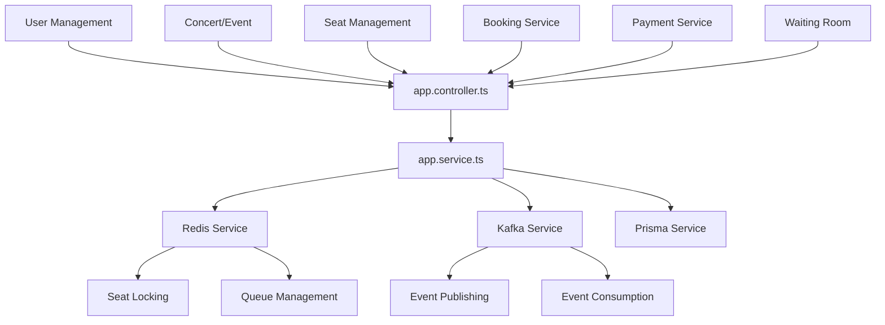

I've revised the plan to use NestJS for all services as requested, while maintaining the critical architecture components needed to solve the thundering herd problem.

## Revised NestJS Implementation Plan

### 1. **Technology Stack Adjustment**
While the business document recommends Go for the Booking Service hotspot, we'll implement **all services in NestJS** as requested, with these optimizations:
- **Booking Service**: Use NestJS with clustering and worker threads for high concurrency
- **Event-driven architecture**: Still implement with Redis and Kafka integration
- **Performance optimizations**: Leverage NestJS's built-in features for high-load scenarios

### 2. **NestJS App Module Structure**
We'll implement all endpoints in a single App Module initially:



### 3. **Critical Implementation Components**

#### **Redis Integration in NestJS**
- **Waiting Room Queue**: FIFO queue for user access control
- **Seat Locking**: Atomic operations with SETEX for 10-minute holds
- **Rate Limiting**: Sliding window algorithm for API protection
- **Session Management**: User data caching for performance

#### **Kafka Integration in NestJS**
- **Microservice Communication**: Event-driven architecture
- **Async Processing**: Payment completions, notifications
- **Event Topics**: ORDER_PAID, BOOKING_CREATED, SEAT_RELEASED

#### **Database Schema**
- **PostgreSQL**: User data, concert info, completed bookings
- **Redis**: Real-time seat status, temporary locks, queue data

### 4. **Endpoint Implementation Plan**

All endpoints will be implemented in [`app.controller.ts`](nestjs/src/app.controller.ts:1) and [`app.service.ts`](nestjs/src/app.service.ts:1):

#### **User Management**
```
POST   /api/users/register     - User registration
POST   /api/users/login        - Authentication
GET    /api/users/profile      - User profile
PUT    /api/users/profile      - Update profile
```

#### **Concert/Event Management**
```
GET    /api/concerts          - List concerts
GET    /api/concerts/:id      - Concert details
```

#### **Seat Management**
```
GET    /api/seats/available   - Available seats for concert
GET    /api/seats/:concertId   - All seats with status
```

#### **Booking Service**
```
POST   /api/bookings          - Create booking (hold seat)
GET    /api/bookings/:id      - Booking details
DELETE /api/bookings/:id      - Cancel booking
```

#### **Payment Processing**
```
POST   /api/payments          - Process payment
GET    /api/payments/:id      - Payment status
```

#### **Waiting Room**
```
GET    /waiting-room          - Enter waiting room
POST   /waiting-room/refresh  - Refresh position
```

### 5. **NestJS-Specific Optimizations**

#### **High Concurrency Handling**
- **Clustering**: Multiple Node.js processes for CPU utilization
- **Worker Threads**: Offload CPU-intensive operations
- **Connection Pooling**: Efficient database connections
- **Caching**: Redis for frequently accessed data

#### **Performance Patterns**
- **Async/Await**: Proper non-blocking operations
- **Streams**: For large data processing
- **Pipes**: Data transformation and validation
- **Guards**: Rate limiting and authentication

### 6. **Implementation Order**
1. Update docker-compose.yml with Redis and Kafka
2. Update Prisma schema for concert booking models
3. Create Redis service integration
4. Create Kafka service integration
5. Implement all endpoints in App Module
6. Add error handling and validation
7. Add structured logging
8. Create unit tests

This revised plan maintains all critical components from the business requirements (Redis for seat management, Kafka for async processing, waiting room for thundering herd prevention) while implementing everything in NestJS as requested. The architecture will still solve the core challenge of handling 1M concurrent users through careful traffic management and event-driven processing.